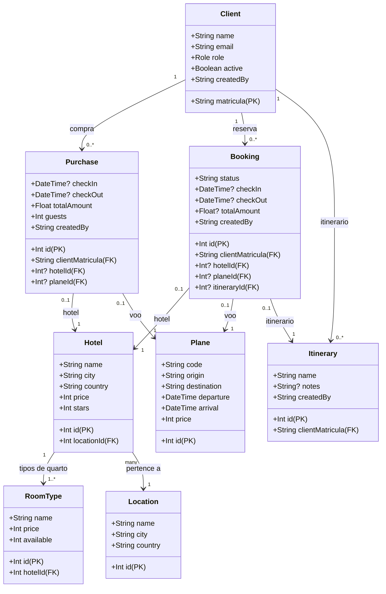

# Contexto do banco de dados (visível para estudantes)

- **Voos**: o banco já vem pré-carregado com ~43.8 mil voos (10 por dia para cada uma das 6 rotas principais, cobrindo 2 anos a partir de hoje). As buscas por origem/destino devem encontrar resultados imediatamente.
- **Hotéis**: existem 5 hotéis cadastrados no ambiente de produção (`leiame.app`), suficientes para os exercícios de seleção, compra, avaliação e reservas.
- **Locais**: existem 5 localidades cadastradas, referenciadas pelos hotéis e usadas nas buscas de destinos.
- **Importante**: as tarefas abaixo permanecem exatamente as mesmas; use os dados acima como referência para explorar, criar compras/reservas e validar os exercícios.

# Tarefas a serem executadas (PT-BR)

1) **Criar seu cadastro (cliente)**  
   Cadastre um cliente com sua matrícula (7 dígitos), nome e e-mail. Depois, confira se o cadastro aparece ao consultar seu próprio registro.

2) **Explorar destinos e hotéis**  
   Veja as cidades/regiões disponíveis e liste os hotéis de uma delas. Use filtros de preço, estrelas ou amenidades, se quiser.

3) **Ver detalhes e disponibilidade de um hotel**  
   Escolha um hotel pelo ID, veja os detalhes e consulte a disponibilidade para um intervalo de datas.

4) **Buscar voos**  
   Procure voos informando origem, destino e data. Abra pelo menos dois voos para ver os detalhes.

5) **Checar ofertas e descontos**  
   Consulte promoções vigentes (do dia ou de uma data específica) e note quais rotas ou hotéis estão com desconto.

6) **Registrar uma viagem (compra)**  
   Junte um hotel e um voo escolhidos, aplique algum desconto se houver, e registre a compra com datas e número de hóspedes.

7) **Alterar ou cancelar a compra**  
   Atualize as datas ou o número de hóspedes da compra. Opcionalmente, faça o cancelamento para praticar exclusão.

8) **Enviar uma avaliação de hotel**  
   Publique uma nota e um comentário para um hotel e depois liste as avaliações para conferir se a sua foi registrada.

9) **Montar um itinerário**  
   Crie um itinerário (ex.: “Viagem de férias”), vincule reservas (hotel/voo) a ele e depois consulte/atualize o itinerário.

10) **Refletir e relatar no agente**  
    Peça para o agente gerar um breve “plano de viagem” com: nome do hotel, número do voo, datas, custo total e descontos aplicados. Mesmo sem gravar isso, o resumo mostra que ele buscou e combinou dados de várias etapas corretamente.
